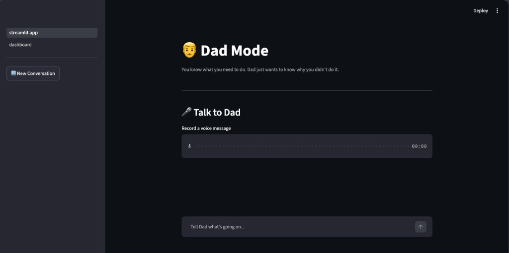
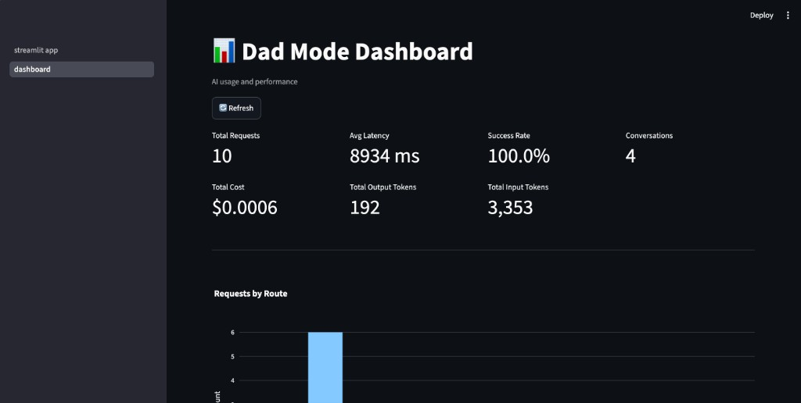
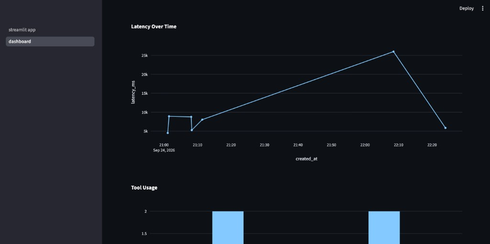
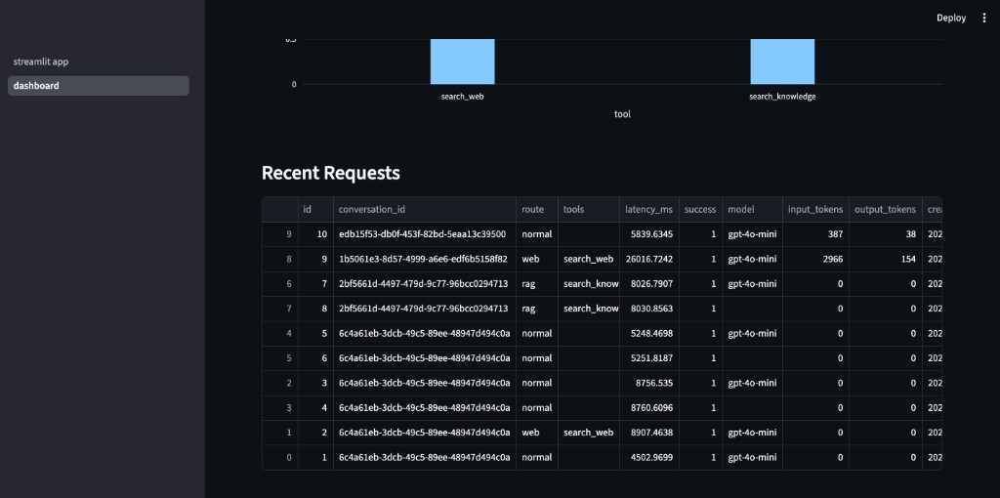

# Dad Mode AI Assistant

An agentic AI assistant that answers text and voice questions with practical advice, persistent memory, grounded knowledge, live web search, and just enough disappointed-dad energy.

## Live app

[Open Dad Mode](https://rishi-1482-dad-mode-frontendstreamlit-app-mdotaw.streamlit.app/)

Go ahead. Ask the question you could have Googled yourself. Dad will wait.

## What it does

- Supports text and voice conversations with Whisper speech-to-text and OpenAI text-to-speech
- Routes requests through direct, RAG, web-search, or hybrid agent workflows
- Ingests TXT, Markdown, and PDF files into a persistent ChromaDB knowledge base
- Uses Tavily for current web information and returns sources used by the agent
- Maintains conversation history and extracts useful, non-sensitive long-term memories with SQLite
- Applies input/output moderation, prompt-injection detection, untrusted-context rules, and token-protected API access
- Tracks routes, tool calls, latency, success rate, model usage, tokens, and estimated cost
- Includes a Streamlit observability dashboard and DeepEval-based AI quality tests in GitHub Actions

Because apparently giving an AI a personality was not enough—it also needed memory, metrics, and a performance review.

## Screenshots

### Text and voice assistant



### Usage and performance overview



### Latency and tool usage



### Recent request telemetry



## Architecture

```text
                 PUBLIC USER
                      │
                      ▼
            Streamlit Community Cloud
              ┌───────┴────────┐
              │ Chat + Voice   │
              │ Dashboard      │
              └───────┬────────┘
                      │
                HTTPS + token
                      │
                      ▼
             Render FastAPI Backend
                      │
              Agent + Guardrails
                      │
          ┌───────────┼───────────┐
          ▼           ▼           ▼
       OpenAI      ChromaDB     Tavily
     LLM/Voice     Private RAG   Live Web
          │           │           │
          └───────────┼───────────┘
                      ▼
              SQLite Persistence
          Conversation │ Memory │ Logs
                      │
                      ▼
                 Dad Response
```

## Technology

- **AI:** OpenAI Responses API, embeddings, Whisper, and TTS
- **Agent tools:** ChromaDB retrieval and Tavily web search
- **Backend:** FastAPI and Uvicorn
- **Frontend:** Streamlit and Plotly
- **Persistence:** SQLite and ChromaDB
- **Evaluation:** DeepEval and pytest
- **Deployment:** Docker, Render, Streamlit Community Cloud, and GitHub Actions

## Local setup

Use Python 3.11 or newer. Dad refuses to debug the Python installation you have been ignoring since last semester.

```bash
python -m venv .venv
source .venv/bin/activate
pip install -r requirements.txt
```

Create a `.env` file:

```env
OPENAI_API_KEY=your-openai-key
TAVILY_API_KEY=your-tavily-key
APP_API_TOKEN=your-private-token
```

Run the backend:

```bash
uvicorn app.api.main:app --reload
```

Run the frontend:

```bash
streamlit run frontend/streamlit_app.py
```

Open the Streamlit URL shown in the terminal. Use the sidebar to switch between the assistant and dashboard.

## Evaluation

Run the guardrail tests:

```bash
python -m pytest tests/test_guardrails.py
```

Run the RAG and agent evaluations:

```bash
PYTHONPATH="$(pwd)" deepeval test run evals/test_rag.py
PYTHONPATH="$(pwd)" deepeval test run evals/test_agent.py
```

GitHub Actions runs the same evaluation workflow on pushes and pull requests to `master`.

That is it. Even Dad thinks you can handle this part.
